# RFC-001: Android App ID Enrichment Pipeline

**Status:** Proposed
**Author:** Mohamed (automated pipeline design)
**Date:** 2026-02-27
**Reviewers:** Security Reviewer, Senior Data Pipeline Engineer, Senior Product Manager

---

## 1. Problem Statement

The Wall's Android app scans installed apps against a company database (`ALL.json`). Currently only **57 companies (0.3%)** out of 15,251 with websites have `android_dev_id` or `android_app_ids` populated. This data is maintained manually in `manualOverrides.ts`, making the Android scanner severely incomplete.

### Current State

| Metric | Count |
|--------|-------|
| Total entries in ALL.json | 20,830 |
| Unique companies with websites | 15,251 |
| Companies with ANY Android data | **57** (0.3%) |
| `android_dev_id` entries | 13 |
| `android_app_ids` entries | 7 |
| BDS_PRIO companies with websites | 16 |
| BDS_PRIO companies with Android data | 10 |

### Goals

- **ZERO false positives** — no company incorrectly linked to an app they don't own
- **ZERO human intervention** — fully automated pipeline with no manual review queue
- **Phased delivery** — ship high-confidence assetlinks probe first, evaluate before adding complexity

---

## 2. High-Level Architecture

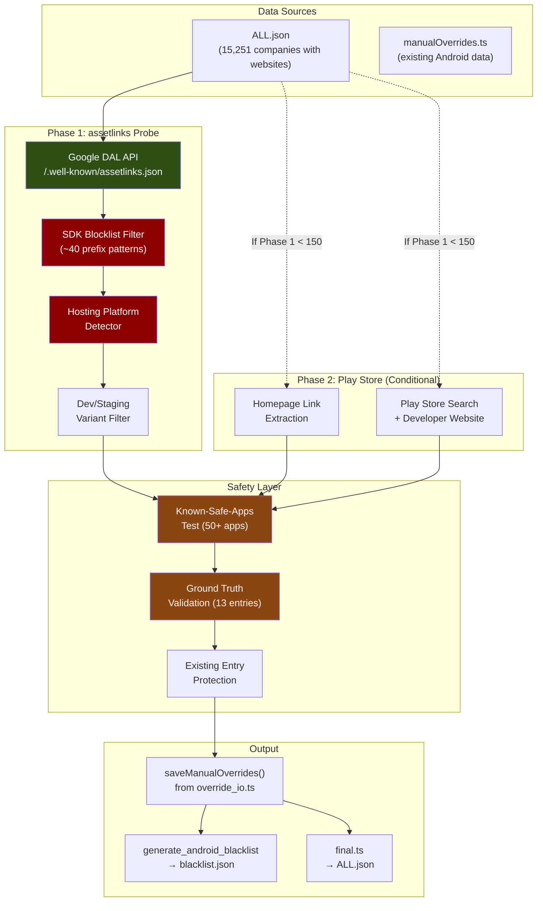

---

## 3. Phase 1: Digital Asset Links Probe

### What Are Digital Asset Links?

Google's [Digital Asset Links](https://developers.google.com/digital-asset-links) (DAL) protocol allows website owners to cryptographically declare which Android apps they own. The file at `https://{domain}/.well-known/assetlinks.json` is controlled by the domain owner and serves as proof of app ownership.

### Discovery Flow

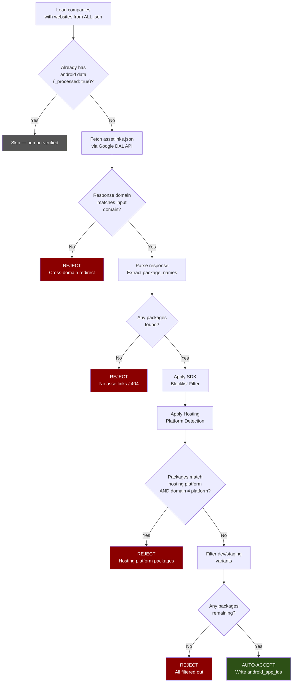

### SDK Blocklist Categories

All filtered using **prefix matching** (e.g., `com.google.android.*` blocks all sub-packages):

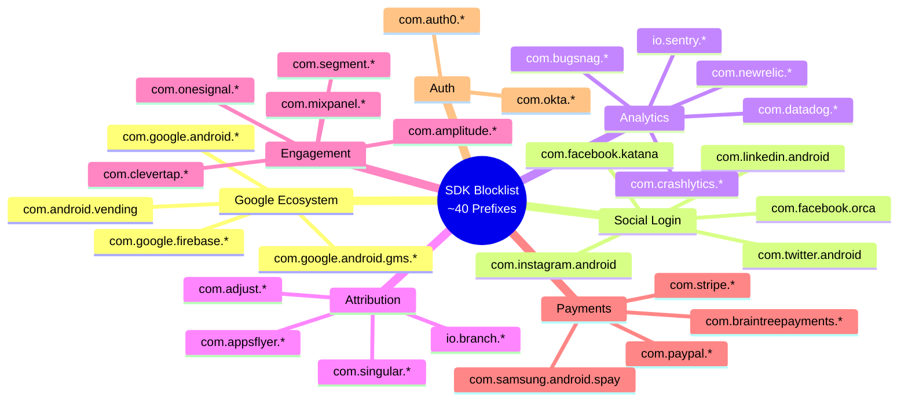

### Hosting Platform Detection

| Platform | Package Prefixes | Action |
|----------|-----------------|--------|
| Wix | `com.wix.*` | Reject if company domain is NOT `wix.com` |
| Shopify | `com.shopify.*` | Reject if company domain is NOT `shopify.com` |
| Squarespace | `com.squarespace.*` | Reject if company domain is NOT `squarespace.com` |
| Webflow | `com.webflow.*` | Reject if company domain is NOT `webflow.com` |
| GoDaddy | `com.godaddy.*` | Reject if company domain is NOT `godaddy.com` |
| Weebly | `com.weebly.*` | Reject if company domain is NOT `weebly.com` |

---

## 4. Phase 2: Play Store Discovery (Conditional)

**Decision gate:** Only proceed if Phase 1 yields fewer than 150 companies.

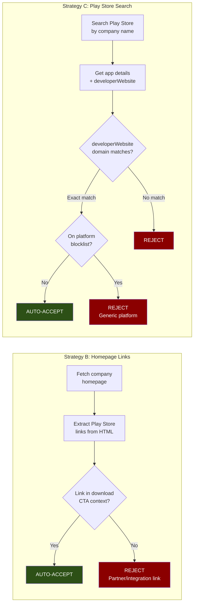

### developerWebsite Platform Blocklist

Do NOT trust `developerWebsite` matches against these generic platform domains:

`wix.com`, `wordpress.com`, `blogspot.com`, `github.io`, `notion.so`, `linktr.ee`, `carrd.co`, `webflow.io`, `squarespace.com`, `godaddysites.com`, `weebly.com`

---

## 5. Acceptance Logic

**Core principle:** Auto-accept only high-confidence signals. Reject everything else. No manual review queue.

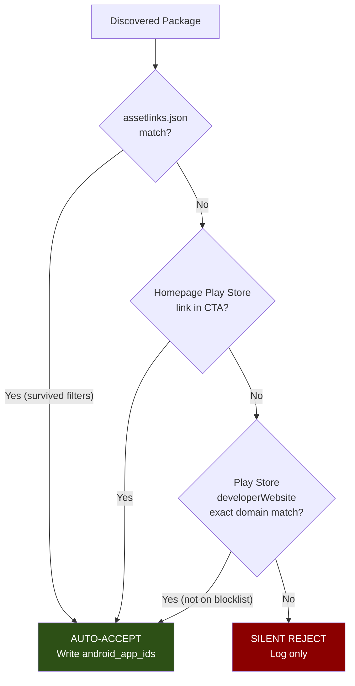

### Why No Review Queue?

The original plan included a manual review queue for medium-confidence results (score 40-69). After independent review, this was eliminated:

1. **Violates "zero human intervention" goal** — any review queue creates operational overhead
2. **Marginal value** — estimated ~50-100 companies in queue, most would be rejected anyway
3. **False positive risk** — human reviewers can make mistakes under fatigue
4. **Simplicity** — binary accept/reject is easier to reason about and maintain

### android_dev_id Safety Rule

**NEVER auto-set `android_dev_id`.** Always use `android_app_ids` (exact match only).

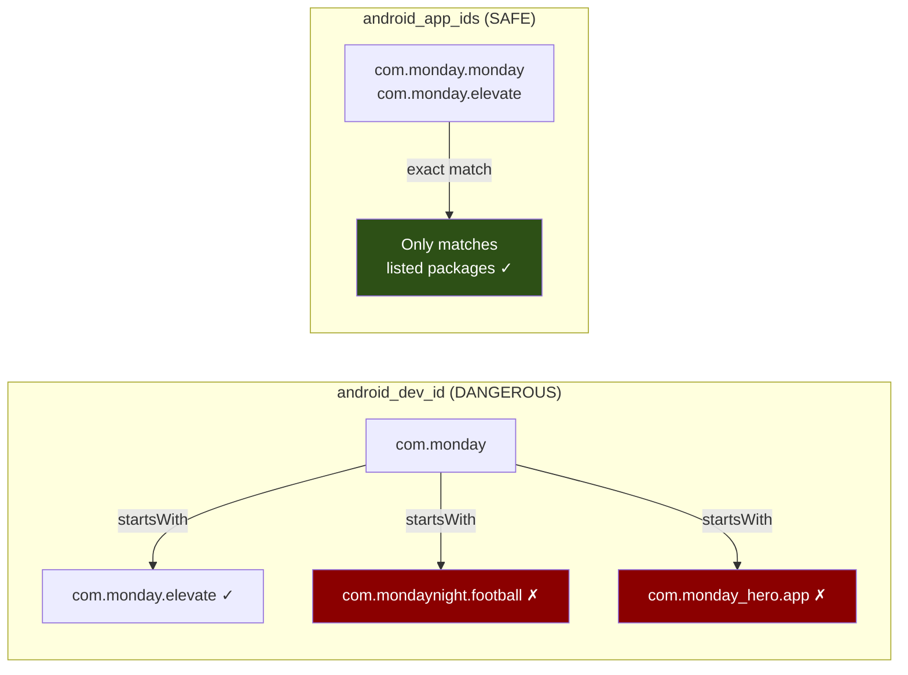

---

## 6. Bug Fix: AppScanner.kt Prefix Collision

**File:** `packages/android/app/src/main/java/com/thewallboycott/android/data/AppScanner.kt` (line 96)

The existing `matchesPackage` function uses `startsWith` without a dot separator, allowing false positives:

```kotlin
// CURRENT (buggy) — "com.wix" matches "com.wixsite.builder"
(item.androidDevId?.let { packageName.startsWith(it) } == true)

// FIXED — "com.wix" only matches "com.wix." prefix or exact "com.wix"
(item.androidDevId?.let { packageName.startsWith("$it.") || packageName == it } == true)
```

This is a separate commit, independent of the enrichment pipeline.

---

## 7. Infrastructure

### Pipeline Data Flow

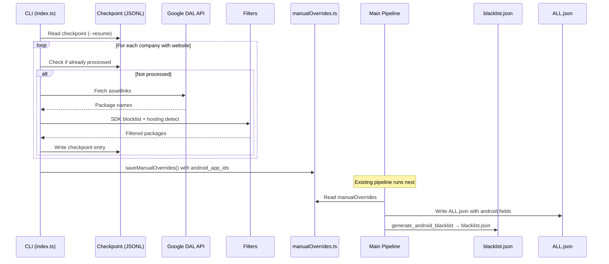

### Crash Recovery with JSONL Checkpointing

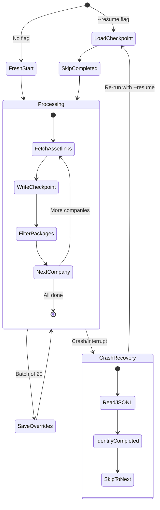

### Existing Functions to Reuse

| Function | Location | Purpose |
|----------|----------|---------|
| `getRegisteredDomain()` | `packages/common/src/index.ts` | Domain comparison using tldts |
| `extractAndroidAppId()` | `packages/scrapper/src/tasks/homepage_ai_extractor/ai_categorizer.ts:72` | Parse Play Store app URLs |
| `extractAndroidDevId()` | `packages/scrapper/src/tasks/homepage_ai_extractor/ai_categorizer.ts:84` | Parse Play Store developer URLs |
| `saveManualOverrides()` | `packages/scrapper/src/tasks/manual_resolve/override_io.ts:68` | Atomic TS file write with Prettier |
| `loadManualOverrides()` | `packages/scrapper/src/tasks/manual_resolve/override_io.ts` | Load and parse manualOverrides |
| `formatAndWrite()` | `packages/common/src/index.ts` | Atomic JSON file writes |
| `BlacklistSchema.parse()` | `packages/common/src/index.ts` | Validate blacklist output |

---

## 8. Safety Guardrails

### Multi-Layer Defense

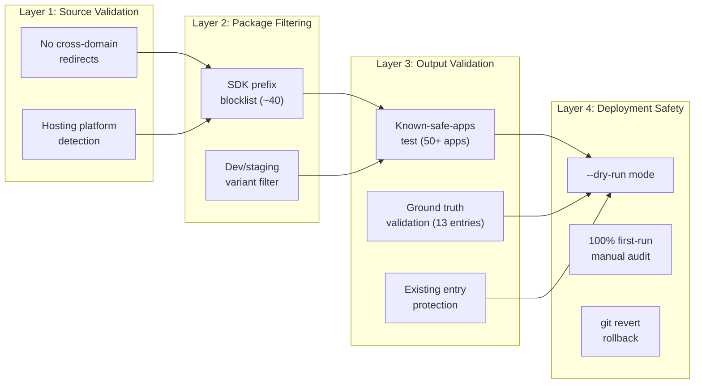

### Known-Safe-Apps Test

A curated list of 50+ popular apps that must NEVER be incorrectly associated with the wrong company. After every enrichment run, simulate the `AppScanner.matchesPackage()` logic. Any match = **pipeline failure**.

Includes edge cases like:
- `com.mondaymotivation.app` (must NOT match Monday.com's `android_dev_id: "com.monday"`)
- `com.wixsite.builder` (must NOT match Wix's `android_dev_id: "com.wix"`)
- `com.etrade.mobilepro` (must NOT match eToro's `android_dev_id: "com.etoro"`)

### Ground Truth Validation

Before trusting auto-discovery, run the pipeline against the **13 existing `android_dev_id` companies** and verify agreement:

| Company | android_dev_id | Expected in assetlinks? |
|---------|---------------|------------------------|
| Wix | `com.wix` | Yes |
| Monday.com | `com.monday` | Yes |
| Fiverr | `com.fiverr` | Yes |
| eToro | `com.etoro` | Yes |
| MoonPay | `com.moonpay` | Likely |
| SentinelOne | `com.sentinelone` | Likely |
| Silverfort | `com.silverfort` | Maybe |
| AU10TIX | `com.au10tix` | Maybe |
| BioCatch | `com.biocatch.biometric` | Maybe |
| Bluesky | `xyz.blueskyweb` | Yes |
| Empathy | `com.empathy` | Maybe |
| Orcam | `com.healthcoda` | Maybe |
| Cocospy | `mobile.app1hh7BC4Jb6` | Unlikely (opaque) |

---

## 9. Processing Priority

```mermaid
gantt
    title Pipeline Execution Order
    dateFormat X
    axisFormat %s

    section BDS_PRIO
    16 companies with websites     :a1, 0, 1

    section BDS_GRASS + BDS_PRESSURE
    ~500 companies                 :a2, 1, 5

    section All Remaining
    ~14,700 companies              :a3, 5, 30
```

### BDS_PRIO Android Gaps (Only 6 Remaining)

| Company | Website | Likely Has App? |
|---------|---------|----------------|
| HP | hp.com | Yes |
| Puma | puma.com | Yes |
| Siemens | siemens.com | Yes |
| AHAV | ahava.com | Unlikely (cosmetics) |
| Sabra | sabra.com | Unlikely (food) |
| SodaStream | sodastream.com | Maybe |

---

## 10. Known Issue: Commented-Out Blacklist Generator

In `packages/scrapper/src/index.ts` (lines 72-73):

```typescript
// log(">>>>>>>>>>>>>>>>>>>>>>>>>>>>>>>>>> Step 9: Generate Android blacklist...")
// await generateAndroidBlacklist()
```

The import is also commented out (line 10). This means `blacklist.json` is NOT being generated by the main pipeline. Must investigate why and re-enable for enrichment data to flow to the Android app.

---

## 11. Risks & Mitigations

| # | Risk | Severity | Mitigation |
|---|------|----------|-----------|
| 1 | Wix/Shopify hosted sites return platform's assetlinks | CRITICAL | Hosting platform package blocklist |
| 2 | SDK packages in assetlinks.json | CRITICAL | Comprehensive prefix-based blocklist (~40 prefixes) |
| 3 | Cross-domain redirects serving wrong assetlinks | HIGH | Never follow cross-domain redirects |
| 4 | `android_dev_id` prefix collision | HIGH | Never auto-set dev_id; always use exact `android_app_ids` |
| 5 | Hacked/compromised assetlinks.json | MEDIUM | Accept risk in Phase 1; Phase 2 cross-validates |
| 6 | Play Store rate limiting (Phase 2) | MEDIUM | Serial requests, exponential backoff, daily cap |
| 7 | Pipeline crash mid-run | LOW | JSONL checkpoint + --resume flag |
| 8 | Breaking existing data | LOW | Never overwrite `_processed: true` entries |

---

## 12. Implementation Order

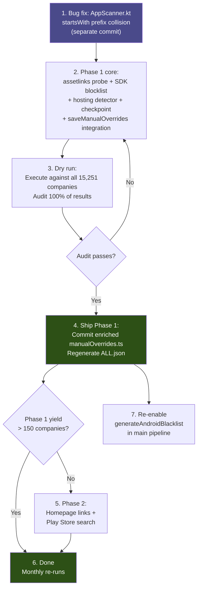

---

## 13. CLI Interface

```bash
# Phase 1 only (default)
pnpm data:android

# With flags
pnpm data:android -- --dry-run          # Preview without writing
pnpm data:android -- --resume           # Resume from checkpoint
pnpm data:android -- --company "Wix"    # Test single company
pnpm data:android -- --mode full        # Phase 1 + Phase 2
```

---

## 14. Success Metrics

| Metric | Target |
|--------|--------|
| BDS_PRIO Android coverage | 100% of companies with apps |
| Overall Android coverage | 200+ companies with `android_app_ids` |
| False positive rate | **0%** (verified by 100% first-run audit) |
| Pipeline run time (Phase 1) | Under 1 hour |
| Human intervention required | **None** |

---

## 15. Rollback Plan

Each enrichment run produces a single git-committable diff to `manualOverrides.ts`:

```bash
git revert <enrichment-commit>
pnpm --filter @theWallProject/scrapper exec ts-node src/tasks/regenerate_db.ts
```

This fully rolls back ALL.json and blacklist.json to pre-enrichment state.

---

## Appendix A: Independent Review Summary

This plan was reviewed by 3 independent experts. Key findings incorporated:

### Security & Data Integrity Reviewer
- 6 CRITICAL, 10 HIGH, 6 MEDIUM findings
- Added: hosting platform detection, comprehensive SDK blocklist, cross-domain redirect protection, developerWebsite platform blocklist, AppScanner.kt bug fix

### Senior Data Pipeline Engineer
- 7 P0, 5 P1, 4 P2 recommendations
- Added: use existing `saveManualOverrides()`, JSONL checkpointing, ground truth validation, address commented-out blacklist generator, `_processed: "android_auto"` traceability

### Senior Product Manager
- Eliminated manual review queue (zero human intervention)
- Phased delivery: ship assetlinks-only first
- Corrected scale: 15,251 companies (not 2,800)
- Only 6 BDS_PRIO gaps remain
- Decision gate before Phase 2 complexity
